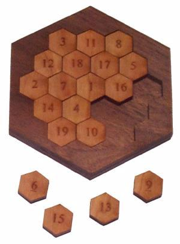

Title:    Magic Hexagon
Proposer: Toby Walsh
Category: Design and configuration, Combinatorial mathematics, Games and puzzles

A magic hexagon consists of the number 1 to 19 arranged in a hexagonal pattern:

<pre>
A,B,C
D,E,F,G
H,I,J,K,L
M,N,O,P
Q,R,S
</pre>

We have a constraint that all diagonals sum to 38. That is,

<pre>
A+B+C = D+E+F+G = ... = Q+R+S = 38,
A+D+H = B+E+I+M = ... = L+P+S = 38,
C+G+L = B+F+K+P = ... = H+M+Q = 38.
</pre>

The problem can be generalized to other sizes. This is the diameter 5 problem.

