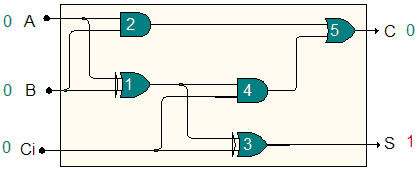

Title:    diagnosis
Proposer: Francisco Azevedo
Category: 

Model-based diagnosis can be seen as taking as input a partially 
parameterized structural description of a system and a set of observations about 
that system. Its output is a set of assumptions which, together with the 
structural description, logically imply the observations, or that are consistent 
with the observations.

Diagnosis is usually applied to combinational digital circuits, seen as 
black-boxes where there is a set of controllable input bits but only a set of 
primary outputs is visible.

The problem is to find the set <i>S</i> of all (minimal) internal faults that 
explain an incorrect output vector <i>F</i> (different than the modelled, predicted, 
output vector <i>N</i>), given some input vector <i>I</i>.

The possible faults consider the usual <i>stuck-at </i>fault model, where faulty 
circuit gates can be either <i>stuck-at-0</i> or <i>stuck-at-1</i>, respectively outputting 
value 0 or 1 independently of the input. 
 
In the example full-adder circuit below, the single faults that explain the 
incorrect output (instead of the expected &lt;00&gt;) are <i>Gate1 stuck-at-1</i> or 
<i>Gate3 
stuck-at-1</i>.

<TT>

 
</TT>
For <i>I</i> = &lt;000&gt; and <i>F</i> = &lt;10&gt; (<i>S</i>=1,<i>C</i>=0), the diagnosis result is thus 
<i>S</i> = {{<i>Gate1</i>/1},{<i>Gate3</i>/1}} (with <i>Gate</i>/1 meaning <i>Gate stuck-at-1</i>). 
Each element of <i>S</i> is an internal malfunction (a set of faults) that is an 
explanation for the incorrect output.

The diagnosis problem becomes more complex when the minimal internal 
malfunction is not a single fault, but rather a set of faulty gates (double 
faults, triple faults, and so on), with complexity increasing with the 
cardinality of such set. We may also want to explicitly find (e.g.) double 
faults instead of single faults to make a problem harder.

